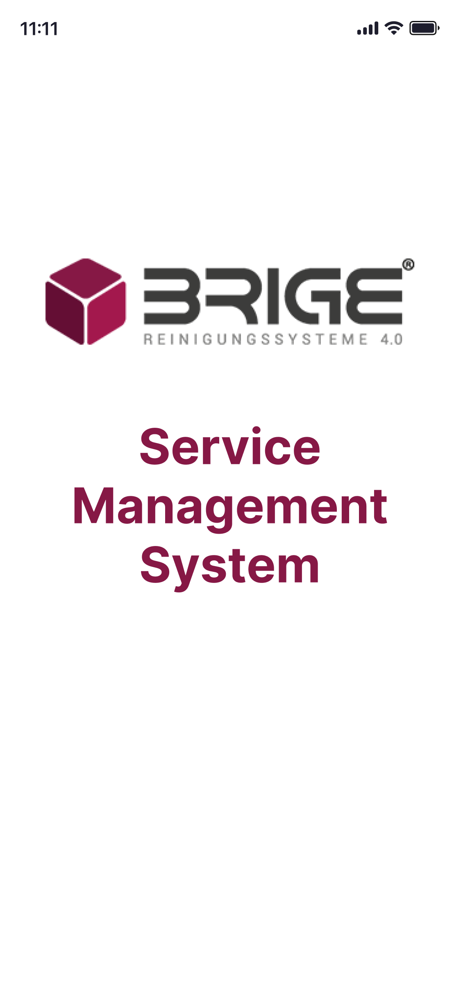

# Appendix A: UI Mockups
 
In this section, we present the mockups for the user interface of the Bridge Client application. These mockups illustrate the design and layout of various screens within the application, providing a visual guide to the user experience. 

## 1. Splash screen

## 2. Login Screen

## 3. Home Screen

